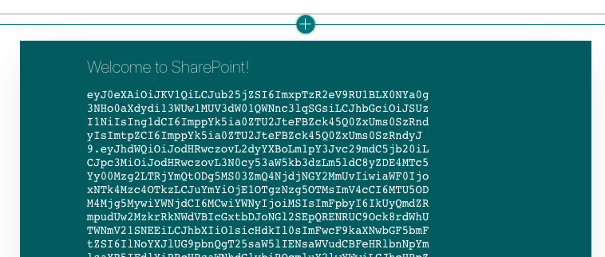

<!-- markdownlint-disable MD002 MD041 -->

<span data-ttu-id="1c227-101">SharePoint Framework elimina la necesidad de registrar una aplicación en Azure AD para obtener los tokens de acceso para obtener acceso a Microsoft Graph.</span><span class="sxs-lookup"><span data-stu-id="1c227-101">The SharePoint Framework eliminates the need to register an application in Azure AD for getting access tokens to access Microsoft Graph.</span></span> <span data-ttu-id="1c227-102">Controla la autenticación del usuario que ha iniciado sesión en SharePoint, lo que permite al elemento Web obtener tokens de usuario.</span><span class="sxs-lookup"><span data-stu-id="1c227-102">It handles the authentication for the user that is logged into SharePoint, allowing your web part to get user tokens.</span></span> <span data-ttu-id="1c227-103">El elemento web necesita indicar los [ámbitos de permisos de grafos](https://docs.microsoft.com/graph/permissions-reference) que necesita y un administrador de inquilinos que puede aprobar dichos permisos durante la instalación.</span><span class="sxs-lookup"><span data-stu-id="1c227-103">Your web part needs to indicate which [Graph permission scopes](https://docs.microsoft.com/graph/permissions-reference) it requires, and a tenant admin can approve those permissions during installation.</span></span>

## <a name="configure-permissions"></a><span data-ttu-id="1c227-104">Configurar permisos</span><span class="sxs-lookup"><span data-stu-id="1c227-104">Configure permissions</span></span>

1. <span data-ttu-id="1c227-105">Open **. carpeta/config/package-solution.js**.</span><span class="sxs-lookup"><span data-stu-id="1c227-105">Open **./config/package-solution.json**.</span></span>

1. <span data-ttu-id="1c227-106">Agregue el siguiente código a la `solution` propiedad.</span><span class="sxs-lookup"><span data-stu-id="1c227-106">Add the following code to the `solution` property.</span></span>

    ```json
    "webApiPermissionRequests": [
      {
        "resource": "Microsoft Graph",
        "scope": "Calendars.ReadWrite"
      },
      {
        "resource": "Microsoft Graph",
        "scope": "User.ReadBasic.All"
      },
      {
        "resource": "Microsoft Graph",
        "scope": "Contacts.Read"
      },
      {
        "resource": "Microsoft Graph",
        "scope": "People.Read"
      }
    ]
    ```

<span data-ttu-id="1c227-107">El `Calendars.ReadWrite` permiso permite que el elemento Web recupere el calendario del usuario y agregue eventos con Microsoft Graph.</span><span class="sxs-lookup"><span data-stu-id="1c227-107">The `Calendars.ReadWrite` permission allows your web part to retrieve the user's calendar and add events using Microsoft Graph.</span></span> <span data-ttu-id="1c227-108">Los otros permisos los utilizan los componentes del kit de herramientas de Microsoft Graph para presentar información sobre los asistentes y los organizadores de eventos.</span><span class="sxs-lookup"><span data-stu-id="1c227-108">The other permissions are used by components in the Microsoft Graph Toolkit to render information about event attendees and organizers.</span></span>

## <a name="optional-test-token-acquisition"></a><span data-ttu-id="1c227-109">Opcional: adquisición de token de prueba</span><span class="sxs-lookup"><span data-stu-id="1c227-109">Optional: Test token acquisition</span></span>

> [!NOTE]
> <span data-ttu-id="1c227-110">El resto de los pasos en esta página son opcionales.</span><span class="sxs-lookup"><span data-stu-id="1c227-110">The rest of the steps on this page are optional.</span></span> <span data-ttu-id="1c227-111">Si prefiere obtener el código de Microsoft Graph directamente, puede continuar para [obtener una vista de calendario](/graph/tutorials/spfx?tutorial-step=3).</span><span class="sxs-lookup"><span data-stu-id="1c227-111">If you'd prefer to get to the Microsoft Graph coding right away, you can proceed to [Get a calendar view](/graph/tutorials/spfx?tutorial-step=3).</span></span>

<span data-ttu-id="1c227-112">Vamos a agregar código temporal al elemento Web para probar la adquisición de tokens.</span><span class="sxs-lookup"><span data-stu-id="1c227-112">Let's add some temporary code to the web part to test token acquisition.</span></span>

1. <span data-ttu-id="1c227-113">Abra **./src/WebParts/graphTutorial/GraphTutorialWebPart.ts** y agregue la siguiente `import` instrucción en la parte superior del archivo.</span><span class="sxs-lookup"><span data-stu-id="1c227-113">Open **./src/webparts/graphTutorial/GraphTutorialWebPart.ts** and add the following `import` statement at the top of the file.</span></span>

    ```typescript
    import { AadTokenProvider } from '@microsoft/sp-http';
    ```

1. <span data-ttu-id="1c227-114">Reemplace la función `render` existente por lo siguiente.</span><span class="sxs-lookup"><span data-stu-id="1c227-114">Replace the existing `render` function with the following.</span></span>

    ```typescript
    public render(): void {
    this.context.aadTokenProviderFactory
      .getTokenProvider()
      .then((provider: AadTokenProvider)=> {
      provider
        .getToken('https://graph.microsoft.com')
        .then((token: string) => {
          this.domElement.innerHTML = `
          <div class="${ styles.graphTutorial }">
            <div class="${ styles.container }">
              <div class="${ styles.row }">
                <div class="${ styles.column }">
                  <span class="${ styles.title }">Welcome to SharePoint!</span>
                  <p><code style="word-break: break-all;">${ token }</code></p>
                </div>
              </div>
            </div>
          </div>`;
        });
      });
    }
    ```

### <a name="deploy-the-web-part"></a><span data-ttu-id="1c227-115">Implementación del elemento Web</span><span class="sxs-lookup"><span data-stu-id="1c227-115">Deploy the web part</span></span>

1. <span data-ttu-id="1c227-116">Ejecute los dos comandos siguientes en la CLI para crear y empaquetar el elemento Web.</span><span class="sxs-lookup"><span data-stu-id="1c227-116">Run the following two commands in your CLI to build and package your web part.</span></span>

    ```Shell
    gulp bundle --ship
    gulp package-solution --ship
    ```

1. <span data-ttu-id="1c227-117">Abra el explorador y vaya al catálogo de aplicaciones de SharePoint del espacio empresarial.</span><span class="sxs-lookup"><span data-stu-id="1c227-117">Open your browser and go to your tenant's SharePoint App Catalog.</span></span> <span data-ttu-id="1c227-118">Seleccione el elemento de menú **aplicaciones para SharePoint** en el lado izquierdo.</span><span class="sxs-lookup"><span data-stu-id="1c227-118">Select the **Apps for SharePoint** menu item on the left-hand side.</span></span>

1. <span data-ttu-id="1c227-119">Cargue el archivo **./SharePoint/Solution/Graph-tutorial.sppkg** .</span><span class="sxs-lookup"><span data-stu-id="1c227-119">Upload the **./sharepoint/solution/graph-tutorial.sppkg** file.</span></span>

1. <span data-ttu-id="1c227-120">En el mensaje **¿confía en...** , confirme que el mensaje muestra los 4 permisos de Microsoft Graph que estableció en el **package-solution.jsen** el archivo.</span><span class="sxs-lookup"><span data-stu-id="1c227-120">In the **Do you trust...** prompt, confirm that the prompt lists the 4 Microsoft Graph permissions you set in the **package-solution.json** file.</span></span> <span data-ttu-id="1c227-121">Seleccione **hacer que esta solución esté disponible para todos los sitios de la organización** y, después, seleccione **implementar**.</span><span class="sxs-lookup"><span data-stu-id="1c227-121">Select **Make this solution available to all sites in the organization** , then select **Deploy**.</span></span>

1. <span data-ttu-id="1c227-122">Vaya al [centro de administración de SharePoint](https://admin.microsoft.com/sharepoint?page=classicfeatures&modern=true) con un administrador de inquilinos.</span><span class="sxs-lookup"><span data-stu-id="1c227-122">Go to the [SharePoint admin center](https://admin.microsoft.com/sharepoint?page=classicfeatures&modern=true) using a tenant administrator.</span></span>

1. <span data-ttu-id="1c227-123">En el menú de la izquierda, seleccione **avanzadas** y, a continuación, **acceso a la API**.</span><span class="sxs-lookup"><span data-stu-id="1c227-123">In the left-hand menu, select **Advanced** , then **API access**.</span></span>

1. <span data-ttu-id="1c227-124">Seleccione cada una de las solicitudes pendientes del paquete **Graph-tutorial-Client-Side-Solution** y elija **aprobar**.</span><span class="sxs-lookup"><span data-stu-id="1c227-124">Select each of the pending requests from the **graph-tutorial-client-side-solution** package and choose **Approve**.</span></span>

    

### <a name="test-the-web-part"></a><span data-ttu-id="1c227-126">Probar el elemento Web</span><span class="sxs-lookup"><span data-stu-id="1c227-126">Test the web part</span></span>

1. <span data-ttu-id="1c227-127">Vaya a un sitio de SharePoint en el que desee probar el elemento Web.</span><span class="sxs-lookup"><span data-stu-id="1c227-127">Go to a SharePoint site where you want to test the web part.</span></span> <span data-ttu-id="1c227-128">Cree una nueva página en la que probar el elemento Web.</span><span class="sxs-lookup"><span data-stu-id="1c227-128">Create a new page to test the web part on.</span></span>

1. <span data-ttu-id="1c227-129">Use el selector de elementos Web para buscar el elemento Web **GraphTutorial** y agregarlo a la página.</span><span class="sxs-lookup"><span data-stu-id="1c227-129">Use the web part picker to find the **GraphTutorial** web part and add it to the page.</span></span>

    

1. <span data-ttu-id="1c227-131">El token de acceso se imprime debajo de la **bienvenida a SharePoint.**</span><span class="sxs-lookup"><span data-stu-id="1c227-131">The access token is printed below the **Welcome to SharePoint!**</span></span> <span data-ttu-id="1c227-132">mensaje en el elemento Web.</span><span class="sxs-lookup"><span data-stu-id="1c227-132">message in the web part.</span></span> <span data-ttu-id="1c227-133">Puede copiar este token y analizarlo en [https://jwt.ms/](https://jwt.ms/) para confirmar que contiene los ámbitos de permisos necesarios para el elemento Web.</span><span class="sxs-lookup"><span data-stu-id="1c227-133">You can copy this token and parse it at [https://jwt.ms/](https://jwt.ms/) to confirm that it contains the permission scopes required by the web part.</span></span>

    
