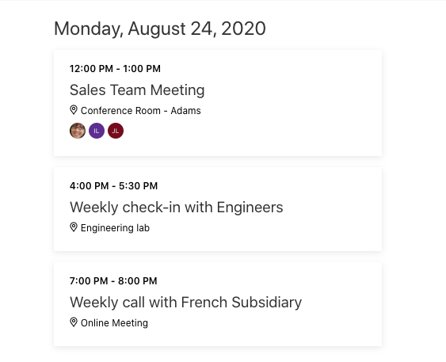

<!-- markdownlint-disable MD002 MD041 -->

En esta sección, usará el kit de [herramientas de Microsoft Graph](https://docs.microsoft.com/graph/toolkit/overview) para reemplazar la lista simple de eventos con una interfaz de usuario enriquecida.

El kit de herramientas proporciona un [componente de agenda](https://docs.microsoft.com/graph/toolkit/components/agenda), que está bien adaptado para representar nuestra lista de eventos.

## <a name="update-the-web-part"></a>Actualizar el elemento Web

1. Abra **./src/WebParts/graphTutorial/GraphTutorialWebPart.Module.SCSS**. Cambie el valor del `background-color` atributo de la `.row` entrada a `$ms-color-white` .

    :::code language="css" source="../demo/graph-tutorial/src/webparts/graphTutorial/GraphTutorialWebPart.module.scss" id="rowScssSnippet" highlight="4":::

1. Agregue la siguiente entrada dentro de la `.graphTutorial` entrada.

    :::code language="css" source="../demo/graph-tutorial/src/webparts/graphTutorial/GraphTutorialWebPart.module.scss" id="addSocialBtnSnippet":::

1. Abra **./src/WebParts/graphTutorial/GraphTutorialWebPart.ts** y agregue la siguiente `import` instrucción en la parte superior del archivo.

    ```typescript
    import { Providers, SharePointProvider, MgtAgenda } from '@microsoft/mgt';
    ```

1. Agregue la siguiente función a la clase **GraphTutorialWebPart** para inicializar el kit de herramientas.

    :::code language="typescript" source="../demo/graph-tutorial/src/webparts/graphTutorial/GraphTutorialWebPart.ts" id="onInitSnippet":::

1. Reemplace la función `renderCalendarView` existente por lo siguiente.

    :::code language="typescript" source="../demo/graph-tutorial/src/webparts/graphTutorial/GraphTutorialWebPart.ts" id="renderCalendarViewSnippet":::

    Esto reemplaza la lista básica con el componente de **agenda** del kit de herramientas.

1. Cree, empaquete y vuelva a cargar el elemento Web y, a continuación, actualice la página donde lo está probando.

    

## <a name="an-alternate-approach"></a>Un método alternativo

En este punto, tiene código que:

- Usa el **MSGraphClient** para obtener la vista de calendario del usuario de la semana actual de Microsoft Graph.
- Agregue estos eventos al componente **agenda** desde el kit de herramientas de Microsoft Graph.

Con este enfoque, tiene control total sobre la llamada a la API de Graph y puede realizar cualquier procesamiento de los eventos antes de la representación que desee. Sin embargo, si no es necesario, puede simplificar la tarea, ya que el componente de **agenda** hará el trabajo por usted.

Todos los componentes del kit de herramientas de Microsoft Graph pueden realizar todas las llamadas de API relevantes a Microsoft Graph. Por ejemplo, agregando el componente de **agenda** al elemento Web y no estableciendo ninguna propiedad, el elemento Web usaría la configuración predeterminada para obtener eventos para el día actual. Veamos cómo podemos lograr los mismos resultados que actualmente tiene (eventos para la semana actual).

1. Reemplace el `render` método existente por lo siguiente.

    :::code language="typescript" source="../demo/graph-tutorial/src/webparts/graphTutorial/GraphTutorialWebPart.ts" id="alternateRenderSnippet":::

    Ahora, en lugar de realizar una llamada de API `render` , simplemente se agrega un `mgt-agenda` elemento directamente en el HTML. Al establecer el `date` Inicio de la semana y `days` a 7, el componente hará la misma llamada a la API que la versión anterior de `render` .

1. Agregue la siguiente función vacía a la clase **GraphTutorialWebPart** .

    ```typescript
    private async addSocialToCalendar() {}
    ```

    > [!NOTE]
    > También se ha agregado un botón **Agregar equipo social** al elemento Web y se ha agregado el `addSocialToCalendar` método como un agente de escucha de eventos.  Implementará el código que se encuentra en la siguiente sección. Por ahora, solo queremos que el código se compile.

1. Cree, empaquete y vuelva a cargar el elemento Web y, a continuación, actualice la página donde lo está probando. La vista debe ser la misma que la prueba anterior.

### <a name="using-the-toolkit-vs-making-api-calls"></a>Usar el kit de herramientas y realizar llamadas API

En este momento, es posible que se pregunte por el problema de usar el **MSGraphClient** en absoluto, cuando el kit de herramientas realice el trabajo por usted. El kit de herramientas está diseñado para representar los resultados que se consultan en Microsoft Graph, como una lista de eventos. Sin embargo, hay escenarios en los que es necesario realizar llamadas a la API.

- Cualquier llamada a la API que no sea una `GET` solicitud. Por ejemplo, la creación de un nuevo evento en el calendario o la actualización del número de teléfono de un usuario.
- Llamadas a la API para obtener datos destinados a ser usados "en segundo plano" y no representados directamente.
